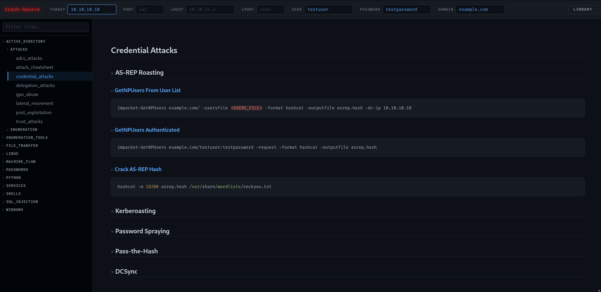
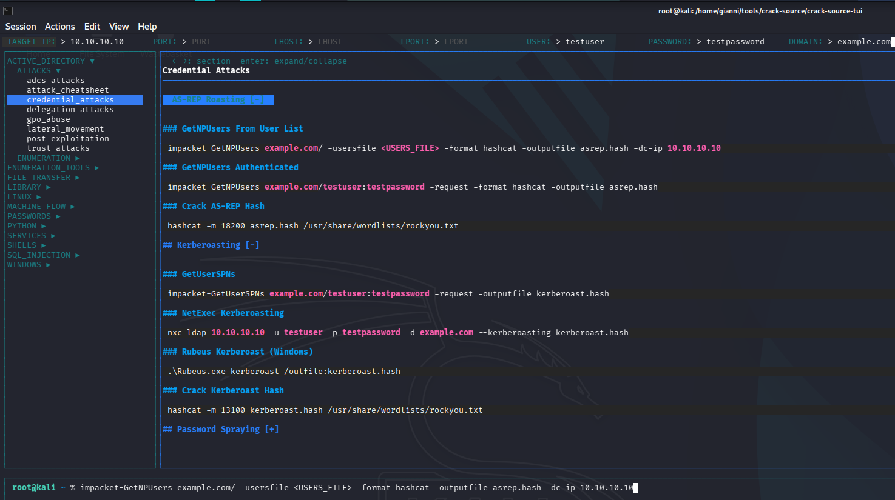

# crack-source

### A few words 

>I built this to help me organize my notes during my ongoing studies for CPTS and OSCP. <br>
>If you want to use this for yourself, I'd highly reccomend you fill the KNOWLEDGE folder with your own notes, that really makes it stick!

>Also, a good portion of this README was created with Claude, it writes a mean markdown - just so you know. 

**crack-source** is a dual-interface penetration testing reference tool. It presents a
structured knowledge base of attack techniques, enumeration cheatsheets, and tool
references through two complementary interfaces that share the same content:

- **Web UI** (`crack-source-web/`) — browser-based, zero dependencies, served statically.
- **Terminal UI** (`crack-source-tui/`) — a Go TUI that runs natively in the operator's shell.

Both consume the same knowledge base in `CONTENT/KNOWLEDGE/` and the same manifest in
`CONTENT/MANIFEST/manifest.json`. They are peers — neither is a subset of the other.

### Web-App



<br>

### TUI



---

## Repository layout

```
crack-source/              ← repo root
├── CONTENT/
│   ├── KNOWLEDGE/         ← all cheatsheet & reference content (Markdown)
│   └── MANIFEST/
│       ├── generate_manifest.py
│       └── manifest.json  ← auto-generated, do not edit by hand
├── crack-source-web/      ← browser UI (HTML/CSS/JS, no build step)
└── crack-source-tui/      ← terminal UI (Go)
```

---

## Usage

### Web UI

Served statically — start a server from the **repo root** (not from `crack-source-web/`),
then open the app path:

```bash
python3 -m http.server 8080
# then open: http://localhost:8080/crack-source-web/
```

> Opening the files directly via `file://` will not work — browsers block `fetch()` for
> local files.

Config lives in `crack-source-web/web.config`:

```
MANIFEST_PATH=CONTENT/MANIFEST/manifest.json
REPO_ROOT=..
```

### Terminal UI

```bash
cd crack-source-tui
go build
./crack-source
```

Config lives in `crack-source-tui/tui.config` (absolute paths required — the TUI reads the
filesystem directly, no HTTP):

```
MANIFEST_PATH=/absolute/path/to/CONTENT/MANIFEST/manifest.json
REPO_ROOT=/absolute/path/to/repo
```

---

## Editing content

Content is plain Markdown under `CONTENT/KNOWLEDGE/`. After **adding, renaming, or removing**
any file there, regenerate the manifest:

```bash
cd CONTENT/MANIFEST && python3 generate_manifest.py
```

Manifest paths are always relative to the repo root — never absolute.

### Placeholder tokens

Both UIs substitute these tokens in cheatsheets. Global tokens are filled once and reused:

| Token           | Meaning                      |
|-----------------|------------------------------|
| `<TARGET_IP>`   | Target machine IP or FQDN    |
| `<PORT>`        | Target service port          |
| `<LHOST>`       | Listener / VPN IP            |
| `<LPORT>`       | Listener port                |

Page-local tokens use lowercase (e.g. `<database>`, `<share>`, `<user>`).

---

## Documentation

Full reference lives in [`docs/`](docs/):

- [Keybindings](docs/keybindings.md) — every TUI key, grouped by pane
- [Authoring content](docs/authoring.md) — placeholder tokens and markdown directives
- [Configuration](docs/configuration.md) — config files and custom keybindings

---

## Contributing

Contributions of every kind are welcome — use it, fork it, modify it, and send changes
back however you see fit.

- **Bugs & ideas** — open an [issue](../../issues).
- **Changes** — fork the repo, create a branch, and open a pull request.
- **Content** — cheatsheets live in `CONTENT/KNOWLEDGE/` as plain Markdown. After adding,
  renaming, or removing any file there, regenerate the manifest before committing:

  ```bash
  cd CONTENT/MANIFEST && python3 generate_manifest.py
  ```

No formal process — small fixes and large features are equally welcome.

## License

Released under the [MIT License](LICENSE) — free to use, modify, distribute, and fork,
for any purpose. See the `LICENSE` file for the full text.
